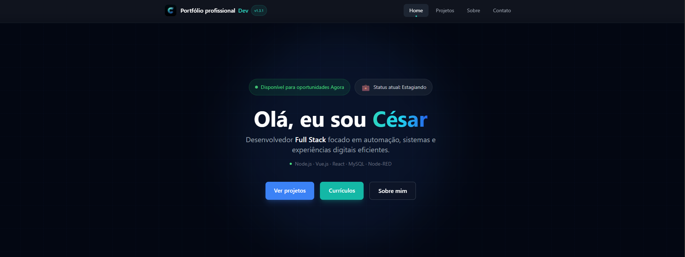
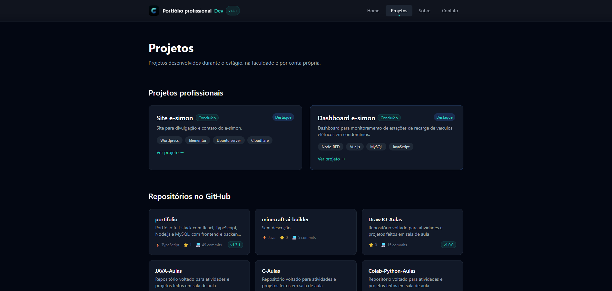
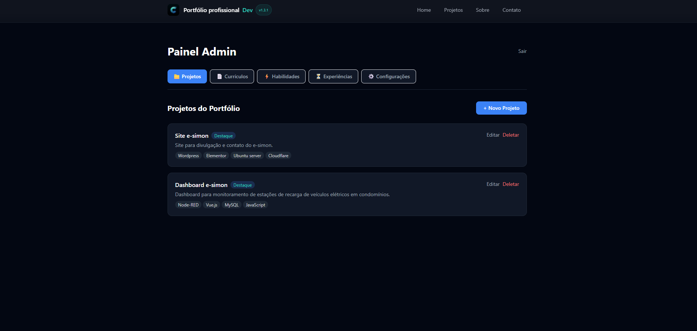
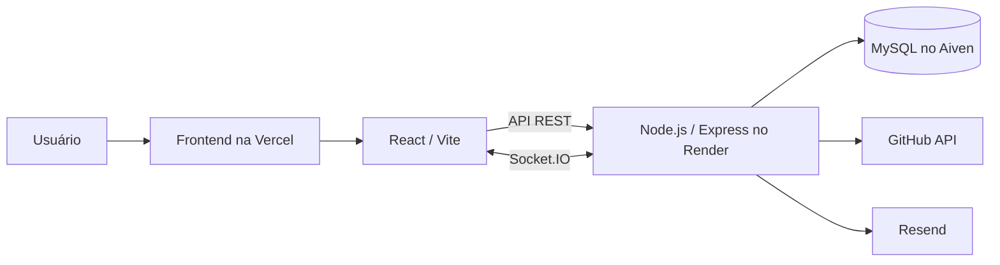

# Portfólio Full-Stack — César

Aplicação web de portfólio para apresentação de projetos, habilidades e experiências, com formulário de contato e painel administrativo autenticado. O projeto separa a interface React de uma API REST em Node.js, persiste os dados em MySQL e distribui atualizações por Socket.IO.

## 🌐 Projeto publicado

[Visualizar portfólio](https://portifolio-kohl-mu.vercel.app)

## 📸 Demonstração

### Página inicial



### Projetos



### Painel administrativo



## ✨ Funcionalidades

- Exibição de projetos, habilidades, experiências e informações do perfil.
- Interface pública em português do Brasil e inglês, com preferência de idioma salva no navegador.
- Painel administrativo protegido para gerenciar projetos, habilidades, experiências, configurações e currículos.
- Conteúdo dinâmico de projetos, habilidades, experiências e configurações com campos em português e inglês.
- Classificação de currículos por idioma (`pt-BR` ou `en`), com todos os arquivos exibidos e identificados nas duas versões do site.
- Autenticação de administrador com JWT e armazenamento de senhas com bcrypt.
- Recuperação de senha e envio do formulário de contato por e-mail com Resend.
- Consulta de repositórios, contribuições, linguagens e versão do portfólio pela API do GitHub.
- Atualização dos clientes conectados após alterações administrativas por Socket.IO.
- Limitação de requisições nas rotas de autenticação e contato.
- Monitoramento da conexão com o banco de dados com notificações de falha e recuperação.

## 🛠️ Tecnologias

### Frontend

- React 19, TypeScript e Vite.
- React Router DOM.
- Tailwind CSS e PostCSS.
- Socket.IO Client.

### Backend

- Node.js e Express 5.
- MySQL com `mysql2`.
- JSON Web Token e bcrypt.
- Socket.IO.
- Resend.
- `express-rate-limit`.

### Infraestrutura

- Vercel para o frontend.
- Render para o backend.
- Aiven para o banco MySQL.

## 🧩 Arquitetura

O repositório utiliza uma organização de monorepo simples. O diretório [`frontend`](./frontend) contém a SPA, enquanto [`backend`](./backend) concentra a API, regras de negócio e acesso ao banco.



Uma descrição mais detalhada dos componentes e fluxos está disponível em [DOCUMENTATION.md](./DOCUMENTATION.md).

## ✅ Pré-requisitos

- Node.js. O repositório não define uma versão mínima em `engines`.
- npm.
- MySQL.
- Git.

## 🚀 Como executar localmente

1. Clone o repositório e acesse a pasta do projeto:

   ```bash
   git clone https://github.com/Cesarcfw/portifolio.git
   cd portifolio
   ```

2. Instale as dependências da raiz, do backend e do frontend:

   ```bash
   npm run install:all
   ```

3. Crie os arquivos locais de ambiente:

   ```bash
   cp backend/.env.example backend/.env
   cp frontend/.env.example frontend/.env
   ```

   No Windows PowerShell, use:

   ```powershell
   Copy-Item backend/.env.example backend/.env
   Copy-Item frontend/.env.example frontend/.env
   ```

4. Preencha as variáveis necessárias. Para desenvolvimento local, mantenha `VITE_API_URL=http://localhost:3000` e configure uma instância MySQL acessível pelo backend.

5. Crie previamente o banco indicado por `DB_NAME` e execute a migração de tabelas a partir da raiz:

   ```bash
   npm run db:migrate
   ```

6. Inicie frontend e backend em paralelo:

   ```bash
   npm run dev
   ```

Com a configuração padrão presente no código, o frontend fica disponível em `http://localhost:5173` e a API em `http://localhost:3000`. Também é possível iniciar cada parte separadamente com `npm run dev:frontend` e `npm run dev:backend`.

## 🔐 Variáveis de ambiente

### Backend

| Variável | Finalidade |
| --- | --- |
| `PORT` | Porta HTTP da API; o código usa `3000` quando não informada. |
| `DB_HOST` | Host do servidor MySQL. |
| `DB_PORT` | Porta do servidor MySQL. |
| `DB_NAME` | Nome do banco de dados. |
| `DB_USER` | Usuário do banco. |
| `DB_PASSWORD` | Senha do banco. |
| `JWT_SECRET` | Chave usada para assinar e validar tokens JWT. |
| `GITHUB_USERNAME` | Usuário consultado nas APIs do GitHub. |
| `GITHUB_TOKEN` | Token usado nas chamadas REST/GraphQL e no gerenciamento de currículos. |
| `RESEND_API_KEY` | Chave da API Resend para e-mails. |
| `MY_EMAIL` | Destinatário dos contatos e alertas. |
| `EMAIL_USER` | Destinatário alternativo usado quando `MY_EMAIL` não está definido. |

### Frontend

| Variável | Finalidade |
| --- | --- |
| `VITE_API_URL` | URL base do backend, sem o sufixo `/api`. |

Os modelos seguros estão em [`backend/.env.example`](./backend/.env.example) e [`frontend/.env.example`](./frontend/.env.example). Arquivos `.env` e `.env.local` estão ignorados pelo Git.

## 🗄️ Banco de dados

O arquivo [`backend/src/database/migrate.js`](./backend/src/database/migrate.js) cria, quando necessário, as tabelas:

- `users`: administradores e hashes de senha;
- `projects`: projetos exibidos no portfólio;
- `settings`: configurações em formato chave/valor;
- `skills`: habilidades e categorias;
- `experiences`: experiências profissionais e acadêmicas.

O banco definido por `DB_NAME` deve existir antes da migração. O comando `npm run db:migrate` executa `backend/src/database/migrate.js`, que cria as tabelas, mas não cria a instância nem o banco MySQL.

A migração também adiciona, em bancos existentes, as colunas de tradução usadas por projetos, habilidades e experiências. Ela preserva os textos atuais; traduções ainda não cadastradas devem ser preenchidas pelo painel administrativo.

Separadamente, durante a inicialização da API, `backend/src/app.js` testa a conexão, garante a existência das tabelas `settings`, `skills` e `experiences` e insere os dados iniciais de habilidades e experiências quando as respectivas tabelas estão vazias. No código atual, esse bloco só é executado quando `RESEND_API_KEY` e um e-mail de destino (`MY_EMAIL` ou `EMAIL_USER`) estão configurados.

Não há mecanismo de reversão de schema.

## 📚 Principais aprendizados

- Separação de responsabilidades entre frontend e backend.
- Criação e consumo de APIs REST.
- Autenticação com JWT e bcrypt.
- Integração e consultas SQL com MySQL.
- Atualizações em tempo real com Socket.IO.
- Configuração segura por variáveis de ambiente.
- Integração com GitHub API e Resend.
- Deploy independente do frontend, backend e banco de dados.

## 🤖 Processo de desenvolvimento

O projeto foi desenvolvido com apoio de documentação, pesquisa técnica e ferramentas de inteligência artificial para acelerar tarefas de implementação, depuração e revisão.

As soluções utilizadas foram testadas, adaptadas e documentadas durante o desenvolvimento, com foco no entendimento da comunicação entre frontend, backend, banco de dados, autenticação e deploy.

## 🔭 Melhorias futuras

- Adicionar um mecanismo para reverter migrações.
- Separar as migrações do processo de inicialização do servidor e versionar alterações de schema.
- Criar testes automatizados para API e interface.
- Documentar os endpoints da API em um formato como OpenAPI.
- Adicionar validação centralizada das variáveis de ambiente na inicialização.

## 📄 Licença e uso

O código e a estrutura deste projeto podem ser utilizados e adaptados
para a criação de outros portfólios pessoais ou profissionais.

Projetos derivados publicados devem incluir uma referência visível ao
repositório original:

> Estrutura do portfólio inspirada no projeto criado por
> [César Maluf](https://github.com/Cesarcfw/portifolio).

A autorização permite modificar a estrutura, publicar um portfólio
próprio e desenvolver versões personalizadas para clientes.

A autorização não inclui o uso das minhas informações pessoais,
fotografias, currículo, biografia, recomendações, dados de contato,
descrições pessoais de projetos ou identidade visual.

Também não é permitido revender o projeto praticamente inalterado como
template, boilerplate, curso ou produto comercial sem autorização
prévia.

Consulte o arquivo [LICENSE](./LICENSE) para conhecer todas as
condições.

### English summary

The source code and structure of this project may be adapted for
personal or professional portfolios, provided that derived public
projects include visible attribution to the original repository.

Personal information, photographs, biography, résumé, testimonials,
contact information and personal branding are not licensed for reuse.

See [LICENSE](./LICENSE) for the complete terms.
