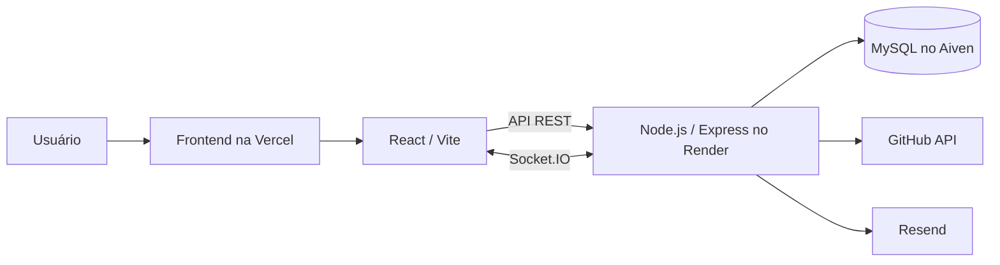

# Portfólio Full-Stack — César

Aplicação web de portfólio para apresentação de projetos, habilidades e experiências, com formulário de contato e painel administrativo autenticado. O projeto separa a interface React de uma API REST em Node.js, persiste os dados em MySQL e distribui atualizações por Socket.IO.

## 🌐 Projeto publicado

[Visualizar portfólio](https://portifolio-kohl-mu.vercel.app)

## 📸 Demonstração

### Página inicial


### Projetos


### Painel administrativo


## ✨ Funcionalidades

- Exibição de projetos, habilidades, experiências e informações do perfil.
- Interface pública em português do Brasil e inglês, com preferência de idioma salva no navegador.
- Painel administrativo protegido para gerenciar projetos, habilidades, experiências, configurações e currículos.
- Conteúdo dinâmico de projetos, habilidades, experiências e configurações com campos em português e inglês.
- Cadastro obrigatório de currículos em pares (`pt-BR` e `en`), vínculo ou complementação de registros antigos, ordenação pelo painel e exibição das duas versões lado a lado.
- Autenticação de administrador com JWT e armazenamento de senhas com bcrypt.
- Recuperação de senha e envio do formulário de contato por e-mail com Resend.
- Consulta de repositórios, contribuições, linguagens e versão do portfólio pela API do GitHub.
- Preservação das descrições originais dos repositórios do GitHub, sem envio do conteúdo para serviços automáticos de tradução.
- Atualização dos clientes conectados após alterações administrativas por Socket.IO.
- Limitação de requisições nas rotas de autenticação e contato.
- Cache e limitação de requisições nas consultas públicas ao GitHub.
- Monitoramento da conexão com o banco de dados com notificações de falha e recuperação.

## 🛠️ Tecnologias

### Frontend

- React 19, TypeScript e Vite.
- React Router DOM.
- Tailwind CSS e PostCSS.
- Socket.IO Client.

### Backend

- Node.js e Express 5.
- MySQL com `mysql2`.
- JSON Web Token e bcrypt.
- Socket.IO.
- Resend.
- `express-rate-limit`.

### Infraestrutura

- Vercel para o frontend.
- Render para o backend.
- Aiven para o banco MySQL.

O arquivo de configuração da Vercel está versionado no frontend. Render e Aiven correspondem à infraestrutura operacional documentada do projeto; suas configurações de painel e credenciais não fazem parte do repositório.

## 🧩 Arquitetura

O repositório utiliza uma organização de monorepo simples. O diretório [`frontend`](./frontend) contém a SPA, enquanto [`backend`](./backend) concentra a API, regras de negócio e acesso ao banco.



Uma descrição mais detalhada dos componentes e fluxos está disponível em [DOCUMENTATION.md](./DOCUMENTATION.md).

## ✅ Pré-requisitos

- Node.js `^20.19.0` ou `>=22.12.0`, conforme `engines` e o requisito do Vite instalado.
- npm.
- MySQL.
- Git.

## 🚀 Como executar localmente

1. Clone o repositório e acesse a pasta do projeto:

   ```bash
   git clone https://github.com/Cesarcfw/portifolio.git
   cd portifolio
   ```

2. Instale as dependências da raiz, do backend e do frontend:

   ```bash
   npm run install:all
   ```

3. Crie os arquivos locais de ambiente:

   ```bash
   cp backend/.env.example backend/.env
   cp frontend/.env.example frontend/.env
   ```

   No Windows PowerShell, use:

   ```powershell
   Copy-Item backend/.env.example backend/.env
   Copy-Item frontend/.env.example frontend/.env
   ```

4. Preencha as variáveis necessárias. Para desenvolvimento local, mantenha `VITE_API_URL=http://localhost:3000` e configure uma instância MySQL acessível pelo backend.

5. Crie previamente o banco indicado por `DB_NAME` e execute a migração de tabelas a partir da raiz:

   ```bash
   npm run db:migrate
   ```

6. Inicie frontend e backend em paralelo:

   ```bash
   npm run dev
   ```

Com a configuração padrão presente no código, o frontend fica disponível em `http://localhost:5173` e a API em `http://localhost:3000`. Também é possível iniciar cada parte separadamente com `npm run dev:frontend` e `npm run dev:backend`.

Antes de publicar, execute a verificação local completa:

```bash
npm run check
```

Esse comando executa os testes do backend, o ESLint do frontend e o build de produção.

## 🔐 Variáveis de ambiente

### Backend

| Variável | Finalidade |
| --- | --- |
| `NODE_ENV` | Ambiente da API; use `production` no deploy e `development` localmente. |
| `PORT` | Porta HTTP da API; o código usa `3000` quando não informada. |
| `FRONTEND_URL` | Origens HTTP/HTTPS autorizadas pelo CORS e URL usada nos links de recuperação; aceita valores sem caminhos, separados por vírgula. |
| `DB_HOST` | Host do servidor MySQL. |
| `DB_PORT` | Porta do servidor MySQL. |
| `DB_NAME` | Nome do banco de dados. |
| `DB_USER` | Usuário do banco. |
| `DB_PASSWORD` | Senha do banco. |
| `DB_SSL_REJECT_UNAUTHORIZED` | Sobrescrita opcional da validação TLS. Com uma CA configurada, a validação fica ativa por padrão; use `false` somente para diagnóstico. |
| `DB_SSL_CA_BASE64` | Certificado CA do MySQL remoto codificado em Base64. Sem esse valor, a conexão remota permanece criptografada, mas não valida a CA privada do provedor. |
| `JWT_SECRET` | Chave com pelo menos 32 caracteres usada para assinar e validar tokens JWT. |
| `ADMIN_SETUP_KEY` | Chave secreta exigida somente na criação do primeiro administrador. |
| `GITHUB_USERNAME` | Usuário consultado nas APIs do GitHub. |
| `GITHUB_TOKEN` | Token usado nas chamadas REST/GraphQL e no gerenciamento de currículos. |
| `RESEND_API_KEY` | Chave da API Resend para e-mails. |
| `MY_EMAIL` | Destinatário dos contatos e alertas. |
| `EMAIL_USER` | Destinatário alternativo usado quando `MY_EMAIL` não está definido. |

### Frontend

| Variável | Finalidade |
| --- | --- |
| `VITE_API_URL` | URL base do backend, sem o sufixo `/api`. |

Os modelos seguros estão em [`backend/.env.example`](./backend/.env.example) e [`frontend/.env.example`](./frontend/.env.example). Arquivos `.env` e `.env.local` estão ignorados pelo Git.

## 🗄️ Banco de dados

O arquivo [`backend/src/database/migrate.js`](./backend/src/database/migrate.js) cria, quando necessário, as tabelas:

- `users`: administradores e hashes de senha;
- `projects`: projetos exibidos no portfólio;
- `settings`: configurações em formato chave/valor;
- `skills`: habilidades e categorias;
- `experiences`: experiências profissionais e acadêmicas.

O banco definido por `DB_NAME` deve existir antes da migração. O comando `npm run db:migrate` executa `backend/src/database/migrate.js`, que cria as tabelas, mas não cria a instância nem o banco MySQL.

A migração também adiciona, em bancos existentes, as colunas de tradução usadas por projetos, habilidades e experiências. Ela preserva os textos atuais; traduções ainda não cadastradas devem ser preenchidas pelo painel administrativo.

Separadamente, durante a inicialização da API, `backend/src/app.js` testa a conexão, garante a existência das tabelas `settings`, `skills` e `experiences` e insere os dados iniciais de habilidades e experiências quando as respectivas tabelas estão vazias. Esse processo é independente da configuração do serviço de e-mail.

Não há mecanismo de reversão de schema.

## 🛡️ Segurança e publicação

- O CORS da API e do Socket.IO aceita o endereço publicado confirmado, os endereços locais de desenvolvimento e as origens informadas em `FRONTEND_URL`.
- Rotas administrativas exigem JWT. A API possui limite geral, com limites adicionais para login, configuração inicial, recuperação de senha, contato e consultas ao GitHub.
- A criação do primeiro administrador exige `ADMIN_SETUP_KEY`; depois do primeiro usuário, novos registros são bloqueados.
- Senhas novas devem conter entre 12 e 128 caracteres. Tokens de recuperação expiram em 15 minutos e deixam de ser válidos após a primeira troca de senha.
- Campos recebidos pela API têm validação de tipo, tamanho e formato. Currículos aceitam somente PDFs identificados como PDF e limitados a 5 MB por arquivo.
- Conteúdo enviado por e-mail é escapado antes de ser inserido no HTML.
- O frontend publicado envia cabeçalhos de segurança, incluindo CSP, HSTS, proteção contra frames e restrições de permissões do navegador. A CSP permite conexões somente com a própria origem e com o backend publicado no Render; se a URL da API mudar, atualize `frontend/vercel.json` junto com `VITE_API_URL`.
- Segredos devem existir somente nas variáveis do ambiente de deploy. Nunca use variáveis `VITE_*` para tokens ou senhas, pois elas são incorporadas ao bundle público.
- `GITHUB_TOKEN` deve ser um token de acesso refinado, restrito a este repositório e somente às permissões necessárias de leitura e escrita de conteúdo.

Relatos de vulnerabilidade devem seguir a [política de segurança](./SECURITY.md), sem publicar credenciais ou detalhes exploráveis em issues públicas.

O upload administrativo grava os PDFs diretamente na branch `main`. Se a branch exigir pull request, autorize especificamente a conta técnica usada pela API na lista de bypass; não remova a proteção para todos os colaboradores.

Para o primeiro administrador, faça uma requisição `POST /api/auth/register` com `email`, `password` e `setupKey`. O valor de `setupKey` deve corresponder a `ADMIN_SETUP_KEY` e não deve ser armazenado no frontend.

Antes de publicar, confirme `NODE_ENV=production`, `FRONTEND_URL`, as credenciais do banco, `JWT_SECRET`, `ADMIN_SETUP_KEY`, GitHub e Resend no painel do provedor.

## 📚 Principais aprendizados

- Separação de responsabilidades entre frontend e backend.
- Criação e consumo de APIs REST.
- Autenticação com JWT e bcrypt.
- Integração e consultas SQL com MySQL.
- Atualizações em tempo real com Socket.IO.
- Configuração segura por variáveis de ambiente.
- Integração com GitHub API e Resend.
- Deploy independente do frontend, backend e banco de dados.

## 🤖 Processo de desenvolvimento

O projeto foi desenvolvido com apoio de documentação, pesquisa técnica e ferramentas de inteligência artificial para acelerar tarefas de implementação, depuração e revisão.

As soluções utilizadas foram testadas, adaptadas e documentadas durante o desenvolvimento, com foco no entendimento da comunicação entre frontend, backend, banco de dados, autenticação e deploy.

## 🔭 Melhorias futuras

- Adicionar um mecanismo para reverter migrações.
- Separar as migrações do processo de inicialização do servidor e versionar alterações de schema.
- Ampliar os testes atuais com cobertura de integração da API, autenticação, banco de dados e interface.
- Automatizar a auditoria de dependências no fluxo de integração contínua.
- Migrar a sessão administrativa para cookie `HttpOnly` com proteção CSRF, reduzindo a exposição do token a scripts executados no navegador.
- Tornar o upload e a remoção dos dois PDFs uma única alteração atômica no GitHub. Atualmente, os arquivos são enviados em commits separados e a remoção no painel retira os metadados da listagem, mas não apaga o PDF nem seu histórico Git.
- Documentar os endpoints da API em um formato como OpenAPI.
- Ampliar a validação de inicialização para todas as integrações opcionais e obrigatórias.

## 📄 Licença e uso

O código e a estrutura deste projeto podem ser utilizados e adaptados
para a criação de outros portfólios pessoais ou profissionais.

Projetos derivados publicados devem incluir uma referência visível ao
repositório original:

> Estrutura do portfólio inspirada no projeto criado por
> [César Maluf](https://github.com/Cesarcfw/portifolio).

A autorização permite modificar a estrutura, publicar um portfólio
próprio e desenvolver versões personalizadas para clientes.

A autorização não inclui o uso das minhas informações pessoais,
fotografias, currículo, biografia, recomendações, dados de contato,
descrições pessoais de projetos ou identidade visual.

Também não é permitido revender o projeto praticamente inalterado como
template, boilerplate, curso ou produto comercial sem autorização
prévia.

Consulte o arquivo [LICENSE](./LICENSE) para conhecer todas as
condições.

### English summary

The source code and structure of this project may be adapted for
personal or professional portfolios, provided that derived public
projects include visible attribution to the original repository.

Personal information, photographs, biography, résumé, testimonials,
contact information and personal branding are not licensed for reuse.

See [LICENSE](./LICENSE) for the complete terms.
